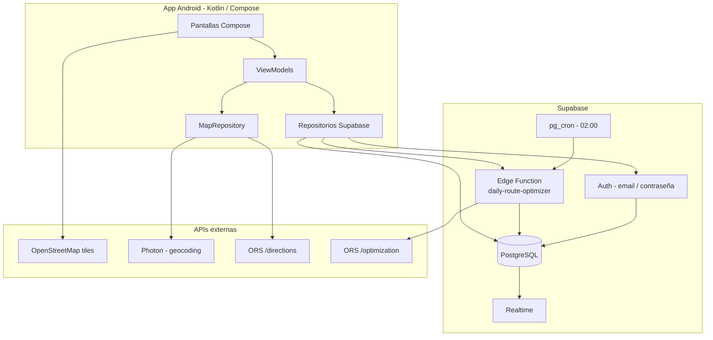

# TrackIt

TrackIt es una aplicación Android de logística de última milla para gestionar paquetes, flota y rutas. La app usa **Supabase** como backend (autenticación, base de datos y funciones serverless) y servicios externos para mapas y optimización de rutas.

## Estado actual

| Área | Estado |
|------|--------|
| **Autenticación** | Real con Supabase Auth (login). El **registro es solo por admin** (Edge Function `admin-create-user`); no hay alta pública. Sesión persistente entre aperturas. |
| **Datos de negocio** | **Offline-first**: Room es la única fuente de verdad; Supabase (PostgreSQL/PostgREST) sincroniza en segundo plano |
| **Mapas en pantalla** | OSMDroid + tiles OpenStreetMap |
| **Geocodificación** | Photon (Komoot) |
| **Rutas punto a punto** | OpenRouteService `/directions` (chofer: auto-ruta a sus paquetes en orden + búsqueda manual) |
| **Optimización de rutas** | Edge Function `daily-route-optimizer` + ORS `/optimization` (VROOM); escribe `route_order` |
| **Escaneo de códigos** | CameraX + ML Kit (permiso runtime; valida el código contra el paquete al cambiar de estado) |
| **Tiempo real** | Parcial: sync por WorkManager (push/pull). Suscripción Realtime completa pendiente |
| **Modo offline** | Implementado (Room + WorkManager): lectura/escritura local con `pendingSync` y sync al recuperar red |

### Flujo de paquetes

```text
EN_DEPOSITO → (cron o asignación manual) → ASIGNADO → CARGADO → EN_CAMINO → ENTREGADO
```

El depósito registra paquetes con fecha programada (por defecto, mañana). El administrador puede generar rutas del día manualmente o dejar que el cron diario las optimice y asigne a los choferes disponibles.

---

## Arquitectura



### Capas en la app

```text
UI (Compose) → ViewModel → IAuthRepository / IPackageRepository / IFleetRepository
                              ↓
                    SupabaseAuthRepository / SupabasePackageRepository / SupabaseFleetRepository
                              ↓
                    Supabase Client (Auth, Postgrest, Realtime, Functions)
```

`TrackItApp` inicializa el cliente Supabase al arrancar. Las claves se leen desde `.env` y se inyectan en `BuildConfig`.

---

## Stack tecnológico

- **Kotlin** + **Jetpack Compose** (Material 3)
- **MVVM** + patrón repositorio
- **Navigation Compose**
- **Supabase Kotlin** (`auth-kt`, `postgrest-kt`, `realtime-kt`, `functions-kt`)
- **Ktor** (motor OkHttp) + **kotlinx.serialization**
- **Retrofit** + Gson (Photon y ORS directions en el cliente)
- **OSMDroid**, **CameraX**, **ML Kit Barcode**

---

## Requisitos

- Android Studio con Android SDK
- **JDK 17**
- Dispositivo o emulador **API 26+**
- Proyecto Supabase configurado (URL + clave anon)
- Clave de **OpenRouteService** (geocoding/rutas en app + optimización en Edge Function)

`local.properties` lo genera Android Studio localmente y no debe commitearse.

---

## Configuración

### 1. Variables de entorno

Copiá `.env.example` a `.env` en la raíz del proyecto:

```env
ORS_API_KEY=tu_clave_openrouteservice
SUPABASE_URL=https://tu-proyecto.supabase.co
SUPABASE_ANON_KEY=tu_clave_anon_o_publishable
```

### 2. Base de datos Supabase

Ejecutá el SQL de migración en el panel de Supabase (SQL Editor) o con la CLI:

- `supabase/migrations/001_initial_schema.sql` — tablas `profiles`, `trucks`, `packages` y políticas RLS

Habilitá en el dashboard:

- **Realtime** en `packages` y `trucks` (recomendado)
- Extensiones **pg_cron** y **pg_net** (para el cron diario)

### 3. Edge Function y cron

- Desplegá `supabase/functions/daily-route-optimizer`
- Configurá secretos: `ORS_API_KEY`, y las variables que use la función (`SUPABASE_URL`, `SUPABASE_SERVICE_ROLE_KEY`)
- Opcional: programá el cron con `supabase/cron/schedule_daily_route_optimizer.sql` (reemplazá `PROJECT_REF` y `SERVICE_ROLE_KEY`)

### 4. Compilar y ejecutar

```bash
# macOS / Linux
./gradlew assembleDebug

# Windows
gradlew.bat assembleDebug
```

Abrí el proyecto en Android Studio, sincronizá Gradle y ejecutá la configuración `app`.

---

## Roles y navegación

### Chofer

Barra inferior: **Ruta**, **Perfil**.

- **Ruta**: paquetes asignados al chofer logueado; escaneo para marcar entregado
- **Detalle de paquete**: mapa OSM, datos del envío, escáner
- **Perfil**: datos de usuario y cierre de sesión

*(El mapa con búsqueda y polyline ORS existe en el código como `MapScreen`; puede no estar en la barra inferior según la build actual.)*

### Empleado de depósito

Barra inferior: **Inicio**, **Historial**, **Perfil**.

- **Ingresos**: alta de paquetes (cliente, dirección con Photon, tamaño, frágil, fecha programada, código de barras)
- **Historial**: paquetes registrados por depósito
- **Perfil**: usuario y logout

### Administrador

Barra inferior: **Flota**, **Mapa global**, **Perfil**.

- **Flota**: camiones y progreso de entregas; botón **Generar rutas del día** (dispara la Edge Function)
- **Asignar ruta**: asignación manual de paquetes en depósito a un chofer
- **Mapa global**: ubicación de camiones y métricas del día
- **Perfil**: usuario y logout

### Autenticación

- **Login**: email y contraseña reales (Supabase Auth). La sesión persiste entre aperturas (pantalla Splash que resuelve la sesión y navega al home del rol).
- **Sin registro público**: el alta de usuarios la hace **solo un admin** desde *Perfil → Crear usuario*, que invoca la Edge Function `admin-create-user` (valida el rol del solicitante server-side y crea el usuario sin cambiar la sesión del admin). Conviene **desactivar los signups** en el dashboard de Supabase.

Al crear un usuario se genera la fila en `auth.users` y su `profiles` con el rol elegido.

---

## Estructura del proyecto

```text
TrackItFront/
├── app/src/main/java/com/trackit/
│   ├── MainActivity.kt
│   ├── TrackItApp.kt              # Cliente Supabase
│   ├── core/navigation/           # NavHost y rutas
│   ├── core/ui/                   # Tema y componentes
│   ├── data/
│   │   ├── model/
│   │   ├── network/               # Photon + ORS (Retrofit)
│   │   ├── repository/            # Supabase*Repository
│   │   └── serialization/
│   └── feature/
│       ├── auth/                  # Login + Registro
│       ├── driver/
│       ├── warehouse/
│       ├── admin/
│       ├── map/
│       └── profile/
├── supabase/
│   ├── migrations/
│   ├── functions/daily-route-optimizer/
│   └── cron/
├── .env.example
└── gradle/libs.versions.toml
```

---

## Próximos pasos

Ya implementado en esta iteración: **offline-first con Room + WorkManager**, **registro solo por admin**, **sesión persistente (Splash)**, **escaneo con permiso runtime y validación de código**, **optimizer con `route_order` y rebalanceo re-ejecutable**, **auto-ruta del chofer** y **mapa global con auto-zoom + última ubicación**.

Pendiente para considerarla **lista para producción en campo**:

### 1. Realtime (prioridad media)

- Suscripción estable a cambios en `packages` (y `trucks`) que actualice Room; la UI ya observa Flows de Room.
- Hoy el refresco es por `SyncWorker` (push/pull) al operar o recuperar red.

### 2. Resolución de conflictos de sync

- La estrategia actual es last-write-wins por `updated_at`. Revisar casos borde (dos choferes / admin editando el mismo paquete).

### 3. Notificaciones push (opcional)

- FCM cuando el cron asigne la ruta del día al chofer.

### 4. Endurecimiento

- Tests de integración para repositorios y flujo de sincronización offline.
- Confirmación de email en Supabase si el proyecto lo exige en producción.
- Auditar políticas RLS (ver `db/`) antes de exponer a producción.

---

## Limitaciones conocidas

- **Realtime** no está activo: la propagación entre dispositivos depende del ciclo de `SyncWorker`.
- La optimización diaria depende de paquetes con `destination_lat` / `destination_lon` y camiones con `driver_id` en Supabase.
- La transición `CARGADO` → `EN_CAMINO` no está expuesta como acción explícita: el chofer entrega directamente desde `CARGADO`/`EN_CAMINO`.
- El depósito marca `CARGADO` por selección (checkbox) desde la lista de `EN_DEPOSITO`/`ASIGNADO`, sin re-escanear cada paquete.

