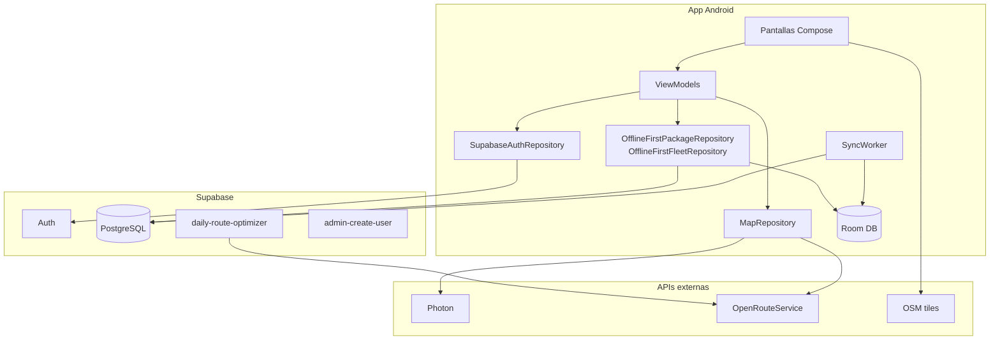

# TrackIt

TrackIt es una aplicación Android de **logística de última milla** para coordinar paquetes, flota y rutas entre **choferes**, **depósito** y **administración**. Está pensada para operación en campo con conectividad intermitente.

## Problema y usuarios

En una operación de reparto urbano necesitás:

- Registrar paquetes en el depósito con dirección geocodificada y código de barras.
- Asignar paradas a choferes y optimizar rutas.
- Que el chofer entregue escaneando el paquete, incluso sin señal.
- Que un admin supervise flota y métricas del día.

**Roles:**

| Rol | Responsabilidad principal |
|-----|---------------------------|
| **Chofer** | Ver ruta del día, navegar, escanear entregas |
| **Depósito** | Ingresar paquetes, cargar camiones, consultar historial |
| **Admin** | Flota, optimización de rutas, asignación manual, alta de usuarios |

Las cuentas las crea un **administrador** (no hay registro público). Ver [Autenticación](#autenticación).

---

## Stack tecnológico

| Capa | Tecnología |
|------|------------|
| UI | Kotlin, Jetpack Compose, Material 3 |
| Arquitectura | MVVM + Repository |
| Navegación | Navigation Compose |
| Persistencia local | Room (offline-first, fuente de verdad) |
| Sync | WorkManager → Supabase PostgREST |
| Backend | Supabase (Auth, PostgreSQL, Edge Functions) |
| Mapas | OSMDroid + OpenStreetMap |
| Geocoding | Photon (Komoot) |
| Rutas | OpenRouteService (directions + optimization vía Edge Function) |
| Escaneo | CameraX + ML Kit Barcode |

**¿Por qué Kotlin + Compose?** Ecosistema nativo Android, excelente soporte para Room/WorkManager/CameraX, UI declarativa y tipado fuerte para dominios con estados (paquetes, rutas, sync).

**minSdk 26 (Android 8.0+):** cubre la gran mayoría del parque instalado en dispositivos corporativos; habilita Notification channels, autofill y APIs modernas de red/permisos sin fragmentación extrema.

---

## Arquitectura



### Capas

```text
UI (Compose) → ViewModel → IAuthRepository / IPackageRepository / IFleetRepository
                              ↓
              SupabaseAuthRepository / OfflineFirst*Repository
                              ↓
              Room (lecturas) + SyncWorker (push/pull a Supabase)
```

`TrackItApp` inicializa Supabase y dispara un sync al arrancar y al recuperar conectividad.

---

## Flujo de paquetes

```text
EN_DEPOSITO → ASIGNADO → CARGADO → EN_CAMINO → ENTREGADO
```

1. **Depósito** ingresa el paquete (fecha programada por defecto: mañana).
2. **Admin** genera rutas (Edge Function + ORS) o asigna manualmente.
3. **Depósito** marca paquetes como **CARGADO** al subirlos al camión.
4. **Chofer** escanea el código para marcar **ENTREGADO** (desde `CARGADO` o `EN_CAMINO`).

---

## Onboarding

TrackIt tiene **dos capas** de introducción:

### 1. Instalación (primera vez en el dispositivo)

Antes del login, tres pantallas explican qué es la app, el modo offline y los permisos (cámara, ubicación). Las credenciales las entrega el admin.

### 2. Tour guiado por rol (primer login de cada usuario)

Tras iniciar sesión, aparecen **coach marks**: ventanas emergentes que resaltan botones reales de la interfaz.

| Rol | Pasos del tour |
|-----|----------------|
| Chofer | Tab Ruta → lista de entregas → Mapa → Perfil |
| Depósito | Ingresar paquete → Cargar camión → Historial → Perfil |
| Admin | Generar rutas → Flota → Mapa global → Perfil |

El chofer ve el tour **después** de registrar su camión (`DriverTruckSetup`). El progreso se guarda en DataStore por usuario.

---

## Navegación por rol

### Chofer

Barra inferior: **Ruta**, **Mapa**, **Perfil**.

| Pantalla | Función |
|----------|---------|
| Ruta | Paquetes asignados; escaneo rápido para entregar |
| Detalle | Mapa OSM, datos del envío, escáner |
| Mapa | Búsqueda de direcciones y polyline ORS |
| Perfil | Datos, **apariencia** (tema/colores) y logout |

Al primer login, si no tiene camión registrado, pasa por **Registrar camión** (patente).

### Depósito

Barra inferior: **Inicio**, **Historial**, **Perfil**.

| Pantalla | Función |
|----------|---------|
| Inicio | Acceso a ingreso y carga de camión |
| Ingreso | Alta con Photon + escaneo de barcode |
| Cargar camión | Selección de paquetes → estado CARGADO |
| Historial | Listado con búsqueda; **editar/eliminar** paquetes en `EN_DEPOSITO` o `ASIGNADO` |
| Perfil | Datos, **apariencia** (tema/colores) y logout |

### Admin

Barra inferior: **Flota**, **Mapa global**, **Perfil**.

| Pantalla | Función |
|----------|---------|
| Flota | Camiones, progreso, botón **Generar rutas del día** |
| Asignar ruta | Edición manual de paradas por chofer |
| Mapa global | Ubicación derivada de última entrega |
| Perfil | Crear usuario, **apariencia**, logout |

---

## CRUD de paquetes (depósito)

| Operación | Dónde | Restricción |
|-----------|-------|-------------|
| **Create** | Inicio → Ingresar paquete | — |
| **Read** | Historial | Paquetes registrados por depósito; búsqueda por cliente |
| **Filter** | Historial → **Filtros** → Aplicar | Por fecha programada y estados acumulativos (ej. Asignado + Cargado) |
| **Update** | Historial → tap en card o menú ⋮ → Editar | Solo `EN_DEPOSITO` / `ASIGNADO` |
| **Delete** | Historial → menú ⋮ → Eliminar (con confirmación) | Solo `EN_DEPOSITO` / `ASIGNADO` |

Los cambios se guardan en Room con `pendingSync` y se suben con `SyncWorker`.

### Filtros en historial

- Abrí **Filtros**, elegí criterios y tocá **Aplicar filtros** (no se aplican solos al cambiar cada chip).
- **Estados acumulativos:** podés marcar varios (ej. Asignado + Cargado); se muestran paquetes que cumplan **cualquiera** de esos estados.
- **Fecha programada:** rango opcional Desde / Hasta sobre `scheduled_date`.
- La búsqueda por nombre de cliente sigue siendo instantánea al escribir.
- **Limpiar** resetea filtros aplicados y el borrador del panel.

---

## Modo offline

- **Room** es la única fuente de verdad para la UI (`Flow` / `StateFlow`).
- Escrituras locales marcan `pendingSync = true`.
- `SyncWorker` hace push de cambios pendientes y pull remoto (sin pisar filas aún pendientes).
- `NetworkConnectivityObserver` encola sync al recuperar red.
- Mensajes de error de red en español en formularios y mapas.

**Funciona sin conexión:** listar/editar/eliminar paquetes (depósito), ver ruta local, marcar entregas (se sincronizan después).

---

## Autenticación

- Login con **email y contraseña** (Supabase Auth).
- **Splash** restaura sesión persistida.
- **Sin alta pública:** el admin crea usuarios desde *Perfil → Crear usuario* (`admin-create-user` Edge Function).
- Conviene desactivar signups en el dashboard de Supabase.

---

## Permisos

| Permiso | Uso | Cuándo se pide |
|---------|-----|----------------|
| `CAMERA` | Escaneo de códigos de barras | Al abrir el escáner (runtime) |
| `ACCESS_FINE_LOCATION` | Mapas y geocoding contextual | Al usar mapas |
| `INTERNET` | Sync y APIs | Manifest |

---

## Apariencia y tema

En **Perfil → Apariencia** (todos los roles):

| Control | Función |
|---------|---------|
| **Sistema** (icono auto) | Sigue el modo claro/oscuro del dispositivo |
| **Claro** (sol) | Tema claro fijo |
| **Oscuro** (luna) | Tema oscuro fijo |
| **Colores adaptativos** | Material You según wallpaper (Android 12+; switch) |

La preferencia se guarda en DataStore y se aplica al instante en toda la app. Con colores adaptativos desactivados se usa la paleta TrackIt (terracotta + verde bosque).

---

Ver **`SETUP.md`** para el paso a paso completo (Supabase, SQL, Edge Functions, cron).

### Variables de entorno

Copiá `.env.example` → `.env`:

```env
ORS_API_KEY=tu_clave_openrouteservice
SUPABASE_URL=https://tu-proyecto.supabase.co
SUPABASE_ANON_KEY=tu_clave_anon
```

### Compilar y ejecutar

Desde la **raíz del proyecto** (`TrackItFront`), en PowerShell:

```powershell
cd C:\Users\shinf\Software\TrackItFront
.\gradlew.bat assembleDebug
```

En macOS / Linux:

```bash
./gradlew assembleDebug
```

> **Nota Windows:** el comando es `.\gradlew.bat`, no `gradlew`. Tenés que estar en la carpeta del repo y el prefijo `.\` es obligatorio en PowerShell.

Abrí el proyecto en Android Studio (JDK 17), sincronizá Gradle y ejecutá `app`.

### Generar APK e instalar en un celular

1. **Debug (rápido, para pruebas internas)**

   ```powershell
   .\gradlew.bat assembleDebug
   ```

   El APK queda en:

   ```text
   app\build\outputs\apk\debug\app-debug.apk
   ```

2. **Copiar al teléfono**
   - USB: conectá el celular, activá **Depuración USB**, y desde Android Studio *Run* ▶, **o**
   - Enviá `app-debug.apk` por Drive/WhatsApp/email y abrilo en el teléfono (permite *orígenes desconocidos* si el sistema lo pide).

3. **Release (entrega / RC)**

   ```powershell
   .\gradlew.bat assembleRelease
   ```

   Salida: `app\build\outputs\apk\release\app-release-unsigned.apk` (sin firma de Play Store; sirve para demo si el dispositivo acepta APKs unsigned o firmás con un keystore de debug/release).

   Para firma de producción, configurá un `signingConfig` en `app/build.gradle.kts` con tu keystore.

4. **Instalar por ADB** (opcional, con celular conectado):

   ```powershell
   adb install -r app\build\outputs\apk\debug\app-debug.apk
   ```

   Necesitás Android SDK Platform-Tools en el PATH (`adb`).

---

## Tests

Tests unitarios en `app/src/test/` con repositorios fake (sin emulador):

```bash
gradlew.bat test
```

| Suite | Qué cubre |
|-------|-----------|
| `LoginViewModelTest` | Validación de campos, login OK/error |
| `HistoryViewModelTest` | Editar/eliminar paquetes, reglas de estado, aplicar filtros |
| `HistoryFiltersTest` | Lógica de filtros por fecha y estados múltiples |
| `PackageExtensionsTest` | Qué paquetes son editables |

---

## Estructura del proyecto

```text
app/src/main/java/com/trackit/
├── MainActivity.kt
├── TrackItApp.kt
├── core/
│   ├── navigation/          # NavHost, rutas, graphs por rol
│   ├── onboarding/          # DataStore, coach marks, tour por rol
│   └── ui/                  # Tema, cards, escáner
├── data/
│   ├── local/               # Room (entities, DAOs, mappers)
│   ├── sync/                # SyncWorker, NetworkConnectivityObserver
│   ├── network/             # Retrofit (Photon, ORS)
│   ├── repository/          # Interfaces + OfflineFirst* + Auth
│   └── model/
└── feature/
    ├── auth/                # Splash, Login
    ├── onboarding/          # Slides de instalación
    ├── driver/
    ├── warehouse/           # Ingreso, historial (CRUD), carga
    ├── admin/
    ├── map/
    └── profile/

supabase/
├── functions/
│   ├── daily-route-optimizer/
│   └── admin-create-user/
└── cron/

db/
└── setup.sql                    # Schema SQL completo para Supabase
```

---

## Limitaciones conocidas

- **Realtime** no activo: sync por WorkManager entre dispositivos.
- **Single-tenant:** todos los usuarios comparten la misma operación (sin workspaces multi-empresa).
- Optimización requiere coordenadas en paquetes y choferes con camión asignado.
- `CARGADO` → entrega directa del chofer (sin acción explícita `EN_CAMINO` en UI).

### Roadmap (futuro)

- Workspaces / multi-empresa con `organization_id` + RLS.
- Suscripción Realtime a `packages` y `trucks`.
- Dynamic color (Material You).

---

## Documentación adicional

- **`SETUP.md`** — despliegue de Supabase, seeds y cron.
- **`db/setup.sql`** — schema SQL para Supabase.
