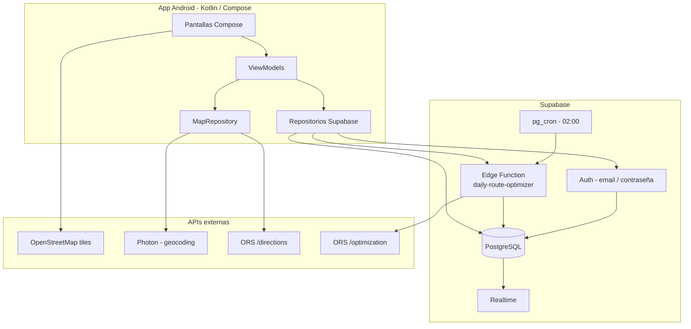

# TrackIt

TrackIt es una aplicación Android de logística de última milla para gestionar paquetes, flota y rutas. La app usa **Supabase** como backend (autenticación, base de datos y funciones serverless) y servicios externos para mapas y optimización de rutas.

## Estado actual

| Área | Estado |
|------|--------|
| **Autenticación** | Real con Supabase Auth (login + registro de cuenta con rol) |
| **Datos de negocio** | Paquetes y camiones en PostgreSQL vía PostgREST |
| **Mapas en pantalla** | OSMDroid + tiles OpenStreetMap |
| **Geocodificación** | Photon (Komoot) |
| **Rutas punto a punto** | OpenRouteService `/directions` (polyline en mapa del chofer) |
| **Optimización de rutas** | Edge Function `daily-route-optimizer` + ORS `/optimization` (VROOM) |
| **Escaneo de códigos** | CameraX + ML Kit |
| **Tiempo real** | Parcial: los repositorios refrescan datos tras cada operación; suscripción Realtime completa pendiente de pulir |
| **Modo offline** | No implementado (requiere Room — ver [Próximos pasos](#próximos-pasos)) |

### Flujo de paquetes

```text
EN_DEPOSITO → (cron o asignación manual) → ASIGNADO → CARGADO → EN_CAMINO → ENTREGADO
```

El depósito registra paquetes con fecha programada (por defecto, mañana). El administrador puede generar rutas del día manualmente o dejar que el cron diario las optimice y asigne a los choferes disponibles.

---

## Arquitectura



### Capas en la app

```text
UI (Compose) → ViewModel → IAuthRepository / IPackageRepository / IFleetRepository
                              ↓
                    SupabaseAuthRepository / SupabasePackageRepository / SupabaseFleetRepository
                              ↓
                    Supabase Client (Auth, Postgrest, Realtime, Functions)
```

`TrackItApp` inicializa el cliente Supabase al arrancar. Las claves se leen desde `.env` y se inyectan en `BuildConfig`.

---

## Stack tecnológico

- **Kotlin** + **Jetpack Compose** (Material 3)
- **MVVM** + patrón repositorio
- **Navigation Compose**
- **Supabase Kotlin** (`auth-kt`, `postgrest-kt`, `realtime-kt`, `functions-kt`)
- **Ktor** (motor OkHttp) + **kotlinx.serialization**
- **Retrofit** + Gson (Photon y ORS directions en el cliente)
- **OSMDroid**, **CameraX**, **ML Kit Barcode**

---

## Requisitos

- Android Studio con Android SDK
- **JDK 17**
- Dispositivo o emulador **API 26+**
- Proyecto Supabase configurado (URL + clave anon)
- Clave de **OpenRouteService** (geocoding/rutas en app + optimización en Edge Function)

`local.properties` lo genera Android Studio localmente y no debe commitearse.

---

## Configuración

### 1. Variables de entorno

Copiá `.env.example` a `.env` en la raíz del proyecto:

```env
ORS_API_KEY=tu_clave_openrouteservice
SUPABASE_URL=https://tu-proyecto.supabase.co
SUPABASE_ANON_KEY=tu_clave_anon_o_publishable
```

### 2. Base de datos Supabase

Ejecutá el SQL de migración en el panel de Supabase (SQL Editor) o con la CLI:

- `supabase/migrations/001_initial_schema.sql` — tablas `profiles`, `trucks`, `packages` y políticas RLS

Habilitá en el dashboard:

- **Realtime** en `packages` y `trucks` (recomendado)
- Extensiones **pg_cron** y **pg_net** (para el cron diario)

### 3. Edge Function y cron

- Desplegá `supabase/functions/daily-route-optimizer`
- Configurá secretos: `ORS_API_KEY`, y las variables que use la función (`SUPABASE_URL`, `SUPABASE_SERVICE_ROLE_KEY`)
- Opcional: programá el cron con `supabase/cron/schedule_daily_route_optimizer.sql` (reemplazá `PROJECT_REF` y `SERVICE_ROLE_KEY`)

### 4. Compilar y ejecutar

```bash
# macOS / Linux
./gradlew assembleDebug

# Windows
gradlew.bat assembleDebug
```

Abrí el proyecto en Android Studio, sincronizá Gradle y ejecutá la configuración `app`.

---

## Roles y navegación

### Chofer

Barra inferior: **Ruta**, **Perfil**.

- **Ruta**: paquetes asignados al chofer logueado; escaneo para marcar entregado
- **Detalle de paquete**: mapa OSM, datos del envío, escáner
- **Perfil**: datos de usuario y cierre de sesión

*(El mapa con búsqueda y polyline ORS existe en el código como `MapScreen`; puede no estar en la barra inferior según la build actual.)*

### Empleado de depósito

Barra inferior: **Inicio**, **Historial**, **Perfil**.

- **Ingresos**: alta de paquetes (cliente, dirección con Photon, tamaño, frágil, fecha programada, código de barras)
- **Historial**: paquetes registrados por depósito
- **Perfil**: usuario y logout

### Administrador

Barra inferior: **Flota**, **Mapa global**, **Perfil**.

- **Flota**: camiones y progreso de entregas; botón **Generar rutas del día** (dispara la Edge Function)
- **Asignar ruta**: asignación manual de paquetes en depósito a un chofer
- **Mapa global**: ubicación de camiones y métricas del día
- **Perfil**: usuario y logout

### Autenticación

- **Login**: email y contraseña reales (Supabase Auth)
- **Registro**: pantalla **Crear cuenta** con nombre, email, contraseña, confirmación y selector de rol (Chofer / Depósito / Administrador)

Tras registrarse, se crea el usuario en `auth.users` y una fila en `profiles` con el rol elegido.

---

## Estructura del proyecto

```text
TrackItFront/
├── app/src/main/java/com/trackit/
│   ├── MainActivity.kt
│   ├── TrackItApp.kt              # Cliente Supabase
│   ├── core/navigation/           # NavHost y rutas
│   ├── core/ui/                   # Tema y componentes
│   ├── data/
│   │   ├── model/
│   │   ├── network/               # Photon + ORS (Retrofit)
│   │   ├── repository/            # Supabase*Repository
│   │   └── serialization/
│   └── feature/
│       ├── auth/                  # Login + Registro
│       ├── driver/
│       ├── warehouse/
│       ├── admin/
│       ├── map/
│       └── profile/
├── supabase/
│   ├── migrations/
│   ├── functions/daily-route-optimizer/
│   └── cron/
├── .env.example
└── gradle/libs.versions.toml
```

---

## Próximos pasos

Para considerar la app **lista para producción en campo** (choferes con conectividad irregular), conviene abordar lo siguiente en este orden sugerido:

### 1. Persistencia local con Room (prioridad alta)

**Problema:** hoy todas las lecturas y escrituras dependen de red. Si el chofer pierde señal al entregar, no puede consultar su ruta ni registrar el cambio de estado de forma fiable.

**Objetivo:**

- Base de datos local (Room) con entidades alineadas a `packages` (y, si aplica, estado de sincronización por fila).
- **Lectura offline:** el chofer ve su ruta y detalle de paquetes desde la caché local.
- **Escritura offline:** acciones como “marcar entregado” o “cargado” se guardan en Room con flag `pending_sync`.
- **Sincronización:** al recuperar conexión, un `SyncWorker` (WorkManager) sube cambios a Supabase y reconcilia conflictos (estrategia last-write-wins o por timestamp).

Casos de uso críticos:

| Rol | Acción offline |
|-----|----------------|
| Chofer | Ver ruta asignada, abrir detalle, escanear y marcar `ENTREGADO` / `CARGADO` |
| Depósito | Opcional: cola de altas de paquetes si no hay red en el depósito |
| Admin | Menor prioridad (suele tener Wi‑Fi en oficina) |

### 2. Realtime y refresco de datos

- Suscripción estable a cambios en `packages` (y `trucks`) para que admin y choferes vean actualizaciones sin reiniciar pantalla.
- Combinar Realtime con Room: Realtime actualiza la BD local; la UI observa Flow de Room.

### 3. Sesión persistente

- Usar `SettingsSessionManager` (o equivalente) en Auth para no pedir login en cada apertura de la app.

### 4. Datos semilla y flota

- Scripts o panel admin para crear camiones (`trucks`) vinculados a perfiles `DRIVER`.
- Validar que la Edge Function solo asigne paquetes con coordenadas (geocoding obligatorio en ingreso).

### 5. Notificaciones push (opcional)

- FCM cuando el cron asigne la ruta del día al chofer.

### 6. Endurecimiento

- Manejo de errores de red en UI (mensajes en español).
- Tests de integración para repositorios y flujo de sincronización offline.
- Confirmación de email en Supabase si el proyecto lo exige en producción.

---

## Limitaciones conocidas

- Sin caché offline: la app requiere conexión para la mayoría de operaciones.
- La optimización diaria depende de paquetes con `destination_lat` / `destination_lon` y camiones con `driver_id` en Supabase.
- El rol en registro lo elige el usuario; en producción conviene restringir quién puede registrarse como `ADMIN`.
- Algunas transiciones de estado (`CARGADO` → `EN_CAMINO`) pueden no estar expuestas en toda la UI.

---

## Licencia

Proyecto académico / demo salvo que los mantenedores agreguen una licencia explícita.
